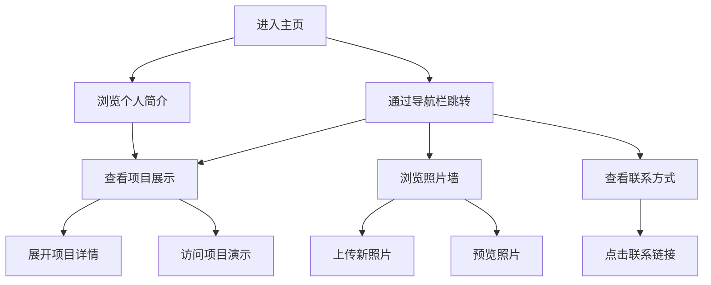

# 个人介绍网页产品需求文档

## 1. 产品概述
一个现代化的个人介绍网页，展示个人信息、项目作品、照片和联系方式，采用单页面设计，支持平滑滚动和导航跳转。
- 为个人品牌建设和职业展示提供专业平台，帮助用户更好地展示自己的技能、经验和作品。
- 目标是创建一个具有现代感和交互性的个人展示网站，提升个人形象和专业度。

## 2. 核心功能

### 2.1 功能模块
我们的个人介绍网页包含以下主要页面：
1. **主页面**：导航栏、个人简介区域、项目展示区域、照片墙区域、联系方式区域。

### 2.2 页面详情

| 页面名称 | 模块名称 | 功能描述 |
|---------|---------|----------|
| 主页面 | 导航栏 | 固定在顶部，包含跳转到各个区域的导航链接，支持平滑滚动定位 |
| 主页面 | 个人简介区域 | 展示个人基本信息、技能、经验等文字介绍内容 |
| 主页面 | 项目展示区域 | 可展开的项目列表，每个项目包含标题、描述、技术栈、演示链接等信息 |
| 主页面 | 照片墙区域 | 支持上传和展示个人照片的网格布局，具有图片预览和管理功能 |
| 主页面 | 联系方式区域 | 展示LinkedIn、GitHub、邮箱等联系方式，包含图标和链接 |

## 3. 核心流程

用户访问网页后，可以通过顶部导航栏快速跳转到感兴趣的区域，也可以通过滚动浏览所有内容。在项目展示区域，用户可以展开查看项目详情和演示。在照片墙区域，用户可以上传新照片或查看现有照片。最后在联系方式区域，用户可以通过各种渠道联系到网页主人。

## 4. 用户界面设计

### 4.1 设计风格
- 主色调：深蓝色 (#2C3E50) 和白色 (#FFFFFF)
- 辅助色：浅灰色 (#ECF0F1) 和橙色 (#E67E22)
- 按钮样式：圆角矩形，具有悬停效果和阴影
- 字体：主标题使用 24-32px，正文使用 16-18px，采用现代无衬线字体
- 布局风格：卡片式设计，顶部固定导航，响应式网格布局
- 图标风格：简洁的线性图标，配合品牌色彩

### 4.2 页面设计概览

| 页面名称 | 模块名称 | UI元素 |
|---------|---------|--------|
| 主页面 | 导航栏 | 固定顶部，半透明背景，白色文字，悬停时橙色高亮 |
| 主页面 | 个人简介区域 | 居中布局，大标题，副标题，段落文字，配色为深蓝色背景白色文字 |
| 主页面 | 项目展示区域 | 卡片式布局，每个项目卡片包含图片、标题、描述，可展开动画效果 |
| 主页面 | 照片墙区域 | 响应式网格布局，图片悬停放大效果，上传按钮采用虚线边框 |
| 主页面 | 联系方式区域 | 水平排列的社交媒体图标，深色背景，图标悬停时放大并变色 |

### 4.3 响应式设计
采用移动优先的响应式设计，在桌面端、平板和手机上都能良好显示。支持触摸交互优化，包括滑动、点击和长按操作。